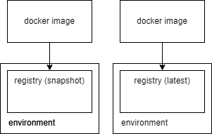

# ECR Design

# ECR Best Practices 
### from TrendMicro
* [/] Ensure that AWS Elastic Container Registry (ECR) repositories are not exposed to everyone. Do not give access to every IAM user.
* [] Ensure that Cross-Region Replication feature is enabled for your Amazon ECR container images.
* [/] Ensure that each Amazon ECR container image is automatically scanned for vulnerabilities when pushed to a repository.
* [/] Ensure that Amazon ECR image repositories are using lifecycle policies for cost optimization.
* [] Ensure that Amazon ECR repositories do not allow unknown cross account access.

### Additionals
* **by Harshad Ranganathan**: https://rharshad.com/ecr-best-practices/