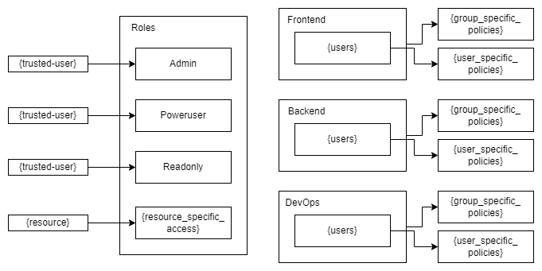

# Accounts Management Design

# IAM Best Practices 
### from TrendMicro
* [] **AWS Account Root User Activity**: Monitor AWS Account Root User Activity
* [] **AWS IAM Groups with Admin Privileges**: Ensure there are no IAM groups with full administrator permissions within your AWS account.
* [] **AWS IAM Password Policy**: Ensure AWS account has an IAM strong password policy in use
* [] **AWS IAM Server Certificate Size**: Ensure that all your SSL/TLS certificates are using either 2048 or 4096 bit RSA keys instead of 1024-bit keys.
* [] **AWS IAM Users with Admin Privileges**: Ensure there are no IAM users with full administrator permissions within your AWS account.
* [] **AWS Multi-Account Centralized Management**: Set up, organize and manage your AWS accounts for optimal security and manageability.
* [] **Access Keys During Initial IAM User Setup**: Ensure no access keys are created during IAM user initial setup with AWS Management Console.
* [] **Access Keys Rotated 30 Days**: Ensure AWS IAM access keys are rotated on a periodic basis as a security best practice (30 Days).
* [] **Access Keys Rotated 45 Days**: Ensure AWS IAM access keys are rotated on a periodic basis as a security best practice (45 Days).
* [] **Access Keys Rotated 90 Days**: Ensure AWS IAM access keys are rotated on a periodic basis as a security best practice (90 Days).
* [] **Account Alternate Contacts**: Ensure alternate contacts are set to improve the security of your AWS account.
* [] **Account Security Challenge Questions**: Ensure security challenge questions are enabled and configured to improve the security of your AWS account.
* [] **Approved ECS Execute Command Access**: Ensure that all access to the ECS Execute Command action is approved
* [] **Attach Policy to IAM Roles Associated with App-Tier EC2 Instances**: Ensure IAM policy for EC2 IAM roles for app tier is configured.
* [] **Attach Policy to IAM Roles Associated with Web-Tier EC2 Instances**: Ensure IAM policy for EC2 IAM roles for web tier is configured.
* [] **Canary Access Token**: Detechs when a canary token access key has been used.
* [] **Check for IAM User Group Membership**: Ensure that all Amazon IAM users have group memberships.
* [] **Check for Overly Permissive IAM Group Policies**: Ensure that Amazon IAM policies attached to IAM groups are not too permissive.
* [] **Check for Unapproved IAM Users Existence**: Ensure there are no unapproved Amazon IAM users available within your AWS cloud account.
* [] **Check for Untrusted Cross-Account IAM Roles**: Ensure that AWS IAM roles cannot be used by untrusted accounts via cross-account access feature.
* [] **Credentials Last Used**: Ensure that unused AWS IAM credentials are decommissioned to follow security best practices.
* [] **Cross-Account Access Lacks External ID and MFA**: Ensure cross-account IAM roles use either MFA or external IDs to secure the access to AWS resources.
* [] **Enable MFA for IAM Users with Console Password**: Ensure that Multi-Factor Authentication (MFA) is enabled for all Amazon IAM users with console access.
* [] **Expired SSL/TLS Certificate**: Ensure expired SSL/TLS certificates are removed from AWS IAM.
* [] **Hardware MFA for AWS Root Account**: Ensure hardware MFA is enabled for your Amazon Web Services root account.
* [] **IAM Access Analyzer in Use**: Ensure that IAM Access Analyzer feature is enabled to maintain access security to your AWS resources.
* [] **IAM Configuration Changes**: AWS IAM configuration changes have been detected within your Amazon Web Services account.
* [] **IAM CreateLoginProfile detected**: AWS IAM 'CreateLoginProfile' call has been detected within your Amazon Web Services account.
* [] **IAM Group With Inline Policies**: Ensure AWS IAM groups do not have inline policies attached.
* [] **IAM Master and IAM Manager Roles**: Ensure that IAM Master and IAM Manager roles are active in your AWS cloud account.
* [] **IAM Policies With Full Administrative Privileges**: Ensure IAM policies that allow full "*:*" administrative privileges are not created.
* [] **IAM Policies with Effect Allow and NotAction**: Ensure AWS IAM policies do not use "Effect" : "Allow" in combination with "NotAction" element to follow security best practices.
* [] **IAM Role Policy Too Permissive**: Ensure AWS IAM policies attached to IAM roles are not too permissive.
* [] **IAM User Password Expiry 30 Days**: Ensure AWS Identity and Access Management (IAM) user passwords are reset before expiration (30 Days).
* [] **IAM User Password Expiry 45 Days**: Ensure AWS Identity and Access Management (IAM) user passwords are reset before expiration (45 Days).
* [] **IAM User Password Expiry 7 Days**: Ensure AWS Identity and Access Management (IAM) user passwords are reset before expiration (7 Days).
* [] **IAM User Policies**: Ensure AWS IAM policies are attached to groups instead of users as an IAM best practice.
* [] **IAM User Present**: Ensure there is at least one IAM user currently used to access your AWS account.
* [] **IAM User with Password and Access Keys**: Ensure that IAM users have either API access or console access in order to follow IAM security best practices.
* [] **IAM Users Unauthorized to Edit Access Policies**: Ensure AWS IAM users that are not authorized to edit IAM access policies are decommissioned..
* [] **Inactive IAM Console User**: Ensure no AWS IAM users have been inactive for a long (specified) period of time.
* [] **MFA Device Deactivated**: A Multi-Factor Authentication (MFA) device deactivation for an IAM user has been detected.
* [] **Pre-Heartbleed Server Certificates**: Ensure that your server certificates are not vulnerable to Heartbleed security bug.
* [] **Receive Permissions via IAM Groups Only**: Ensure that IAM users receive permissions only through IAM groups.
* [] **Root Account Access Keys Present**: Ensure that your AWS root account is not using access keys as a security best practice.
* [] **Root Account Active Signing Certificates**: Ensure that your AWS root account user is not using X.509 certificates to validate API requests.
* [] **Root Account Credentials Usage**: Ensure that root account credentials have not been used recently to access your AWS account.
* [] **Root MFA Enabled**: Ensure that Multi-Factor Authentication (MFA) is enabled for your AWS root account.
* [] **SSH Public Keys Rotated 30 Days**: Ensure AWS IAM SSH public keys are rotated on a periodic basis as a security best practice.
* [] **SSH Public Keys Rotateed 45 Days**: Ensure IAM SSH public keys are rotated on a periodic basis to adhere to AWS security best practices.
* [] **SSH Public Keys Rotated 90 Days**: Ensure IAM SSH public keys are rotated on a periodic basis to adhere to AWS security best practices.
* [] **SSL/TLS Certificate Expiry 30 Days**: Ensure SSL/TLS certificates are renewed before their expiration.
* [] **SSL/TLS Certificate Expiry 45 Days**: Ensure SSL/TLS certificates are renewed before their expiration.
* [] **SSL/TLS Certificate Expiry 7 Days**: Ensure SSL/TLS certificates are renewed before their expiration.
* [] **Sign-In Events**: AWS sign-in events for IAM and federated users have been detected.
* [] **Support Role**: Ensure there is an active Amazon IAM Support Role available within your AWS account.
* [] **Unapproved IAM Policy in Use**: Ensure there are no unapproved AWS Identity and Access Management (IAM) policies in use.
* [] **Unnecessary Access Keys**: Ensure there is a maximum of one active access key pair available for any single IAM user.
* [] **Unnecessary SSH Public Keys**: Ensure there is a maximum of one active SSH public keys assigned to any single IAM user.
* [] **Unused IAM Group**: Ensure AWS IAM groups have at least one user attached as a security best practice.
* [] **Unused IAM User**: Ensure unused IAM users are removed from AWS account to follow security best practice.
* [] **Valid IAM Identity Providers**: Ensure valid IAM Identity Providers are used within your AWS account for secure user authentication and authorization.

